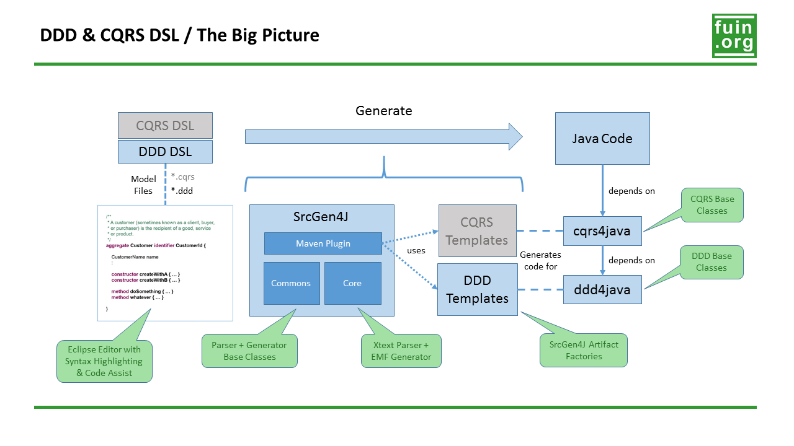

The Big Picture
===============

A DSL alone is not very useful itself. You will need some kind of generator to create code or other artifacts from it. 

There are several "fuin.org" side projects that will help you with this task:

* [DDD DSL](https://github.com/fuinorg/org.fuin.dsl.ddd/) - Xtext based DSL supporting Domain-driven design (DDD)
* [CQRS DSL](https://github.com/fuinorg/org.fuin.dsl.cqrs/) - Xtext based DSL supporting Command Query Responsibility Segregation (CQRS) // ___OUTDATED___
* [srcgen4j-commons](https://github.com/fuinorg/srcgen4j-commons) - Source code generation for Java (Base classes)
* [srcgen4j-core](https://github.com/fuinorg/srcgen4j-core) - Source code generation for Java (XtextParser / EMFGenerator)
* [srcgen4j-maven](https://github.com/fuinorg/srcgen4j-maven) - Maven plugin to execute parse & generate workflows
* [ddd-templates](https://github.com/fuinorg/ddd-templates) - SrcGen4J templates to generate DDD Java code
* *cqrs-templates* - SrcGen4J templates to generate CQRS Java code // ___COMING SOON___
* [ddd-4-java](https://github.com/fuinorg/ddd-4-java) - Base classes for Domain Driven Design (DDD) with Java
* [cqrs-4-java](https://github.com/fuinorg/cqrs-4-java) - Base classes for Command Query Responsibility Segregation (CQRS) with Java

An example can be found here: [ddd-dsl-test](https://github.com/fuinorg/org.fuin.dsl.ddd/tree/master/ddd-dsl-test)

